# GNOSIS

`GNOSIS` is a `shiny` app that enables the exploration, visualisation and 
analysis of clinical and CNA summary data uploaded manually or obtained 
from cBioPortal, through `cBioPortalData`. GNOSIS provides an intuitive 
GUI with multiple tab panels supporting a range of functionalities including 
data upload and initial exploration, data recoding and subsetting, multiple 
visualisations, survival analysis, statistical analysis and mutation analysis.

# Installation

```{r, eval=FALSE}
if (!requireNamespace("BiocManager", quietly = TRUE)) {
    install.packages("BiocManager")
}

BiocManager::install("GNOSIS")
```

# Loading the package

```{r,include=TRUE, results="hide", message=FALSE, warning=FALSE}
library(GNOSIS)
```

# Launching GNOSIS

```{r, eval=FALSE}
GNOSIS()
```

# GNOSIS layout 

The GNOSIS GUI has 4 main elements:
(1) A sidebar where each analysis tab can be selected, the Exploratory Tables tab
    is selected and displayed.
(2) Tab panels within each tab, allowing multiple operations to be carried out
    and viewed in the one tab.
(3) A box sidebar allowing users to select inputs, alter arguments and customise
    and export visualisations.
(4) Main viewing panel displaying output.

```{r,echo=FALSE}
knitr::include_graphics("figures/GNOSIS_Pic.png")
```

# Data upload and preview 

Users can upload their own clinical, CNA or mutation data stored on their local
machine, or select a cBioPortal study to upload:

```{r,echo=FALSE}
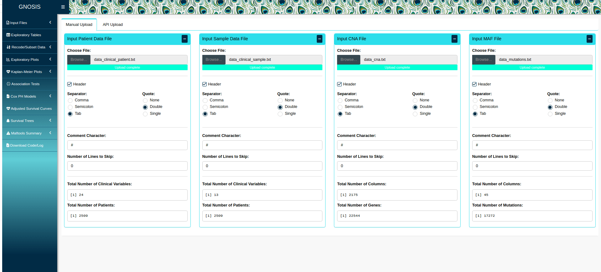
```
<br>
```{r,echo=FALSE}
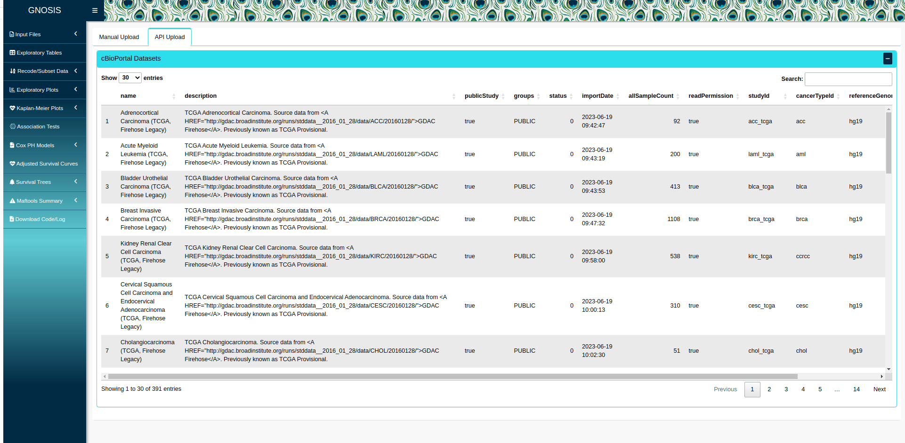
```

<br>

A preview of the uploaded/selected data is provided in the GNOSIS viewing panel 
to ensure that the data has been read in correctly:

```{r,echo=FALSE}
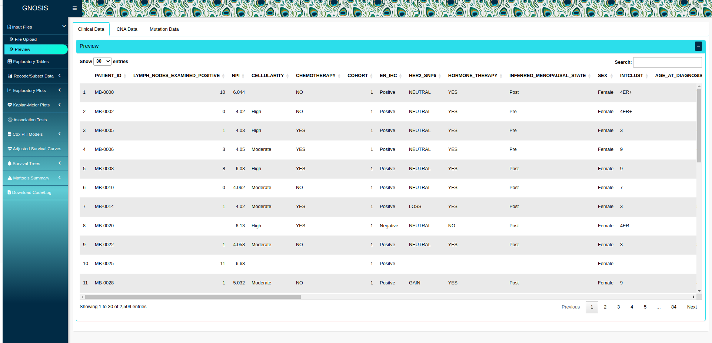
```
<br>
```{r,echo=FALSE}
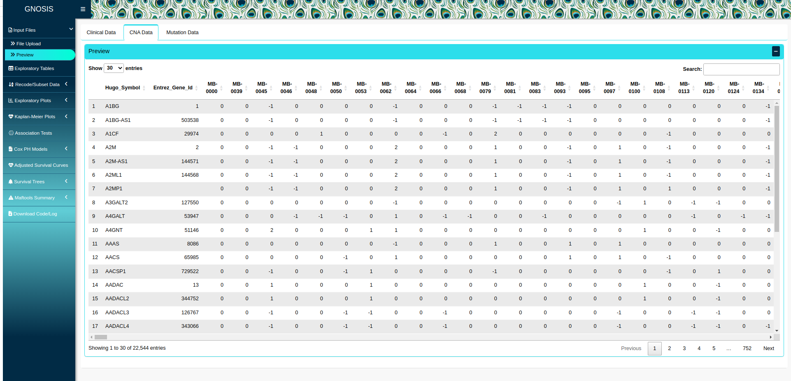
```
<br>
```{r,echo=FALSE}
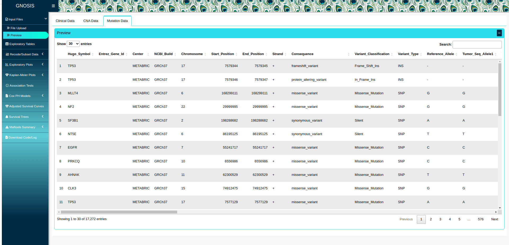
```
<br>

In the case where a cBioPortal study does not contain CNA and/or MAF data, a 
warning will be produced alerting users to this. 

In addition, users can select specific columns of each dataframe to inspect:

```{r,echo=FALSE}
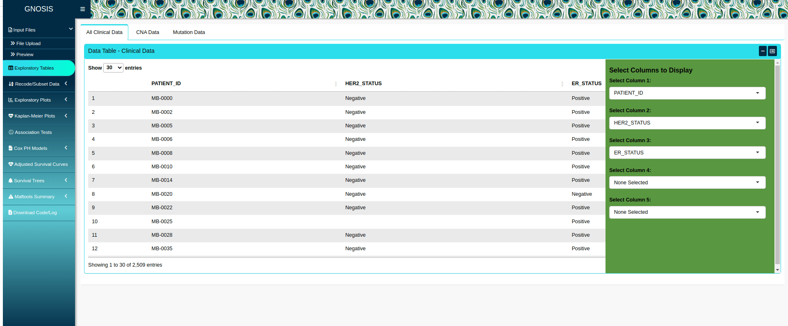
```

# Data reformatting and filtering

To prepare the data for downstream analysis a number a things can be done. 
Firstly users can change the type of variables to numeric or factors using the 
box sidebar, which contains a space to select relevant variables:

```{r,echo=FALSE}
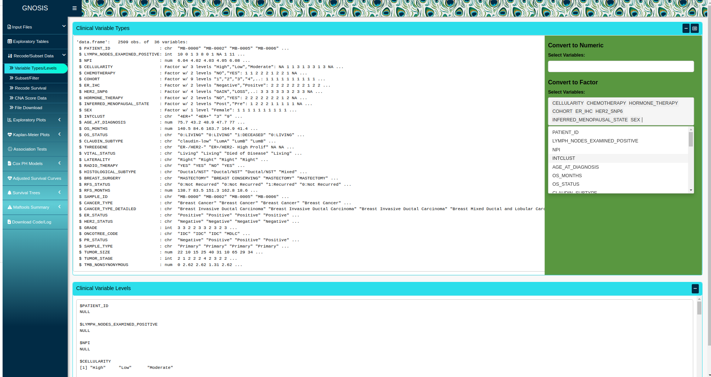
```

<br>

Subsequently, users can subset the data based on up to three categorical 
variables and carry out survival variable recoding.

Here we filter the data to only include patients who received chemotherapy:

```{r,echo=FALSE}
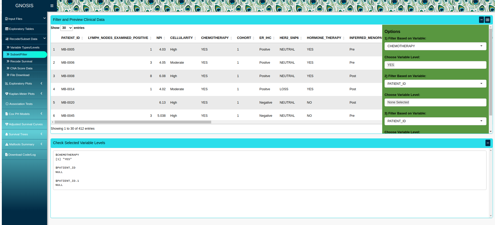
```

We also recode the overall and disease-specific survival to 0/1: 

```{r,echo=FALSE}
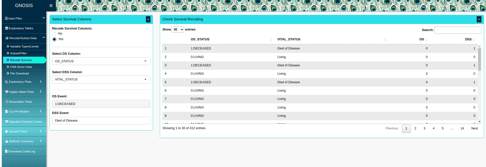
```

<br>
 
In cases where CNA data is uploaded, users may produce and segment CNA metrics 
for each patient, as well as select and extract specific genes for further 
analysis: 

```{r,echo=FALSE}
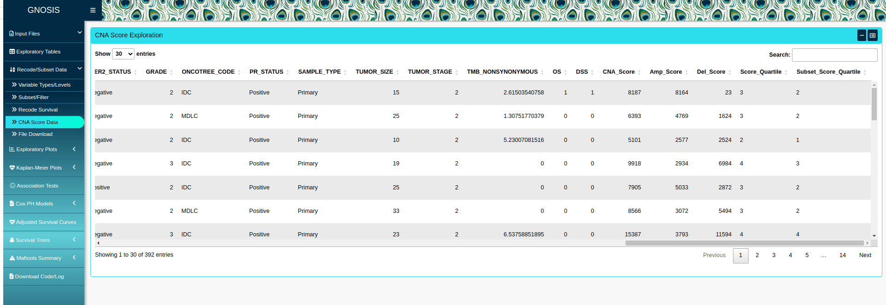
```

# Data visualisation 

Users can produce a range of visualisations including boxplots, scatterplots, 
barplots, histograms and density plots.

Here is an example of a customisable boxplot, that can also be downloaded:

```{r,echo=FALSE}
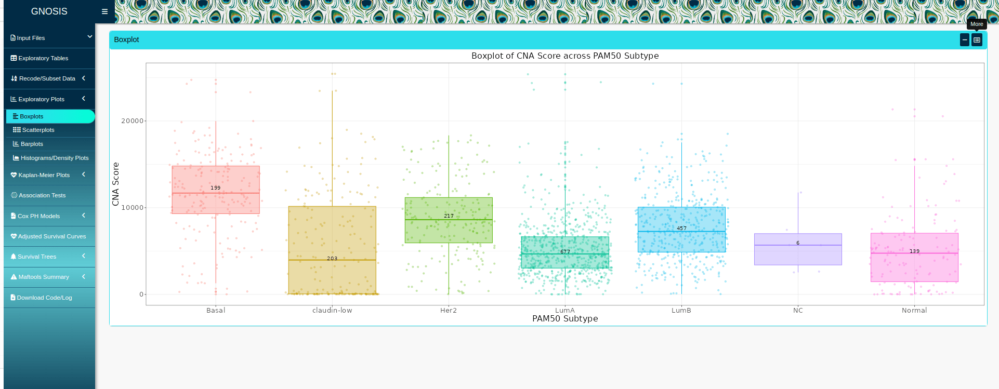
```

# Statistical and survival analysis 

The primary function offered by GNOSIS is statistically robust survival analysis. 
GNOSIS contains several step-wise tabs to provide a complete survival analysis 
of the data under investigation.

Users can produce KM survival curves and the corresponding logrank tests to 
identify survival-associated categorical variables, both visually and 
statistically. 

```{r,echo=FALSE}
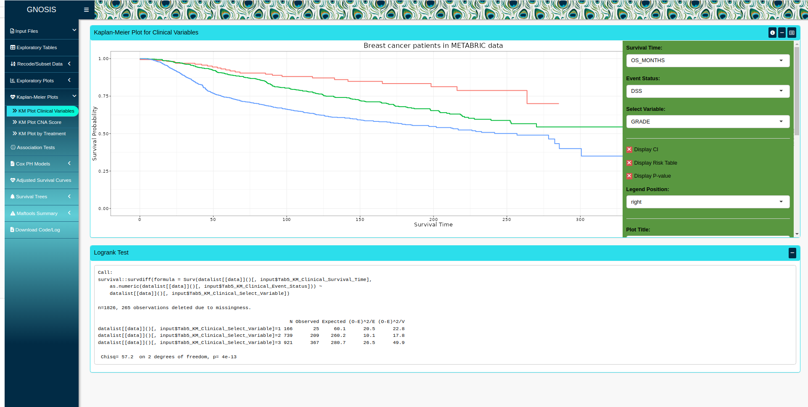
```
<br>
```{r,echo=FALSE}
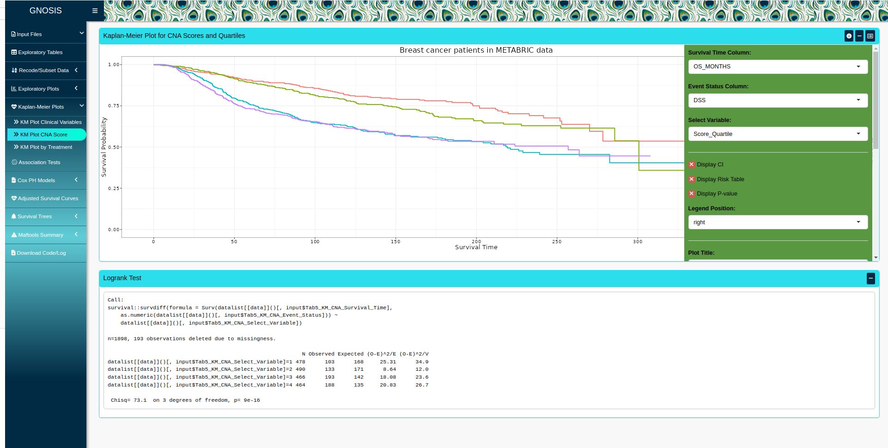
```

<br>

Users can perform a selection of association tests to identify variables that 
are associated with each other. This enables users to identify potential 
confounding variables in the analysis. 

Statistical association tests available include the Chi-squared test, Fisher’s 
exact test, simulated Fisher’s exact test, ANOVA, Kruskal-Wallis test, 
pairwise t-test and Dunn’s test. 

```{r,echo=FALSE}
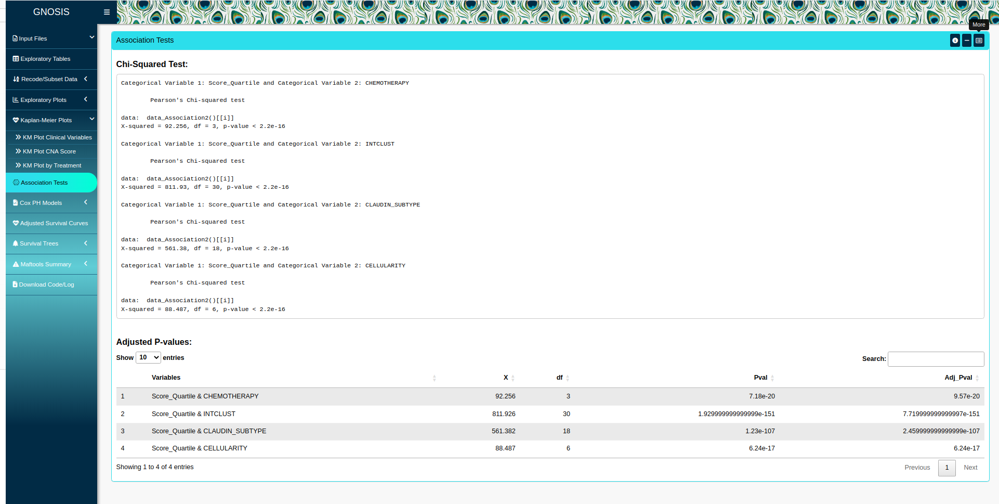
```

<br>

Users can produce both univariate and multivariable Cox models to identify 
survival-associated variables, and test the assumptions of these models using 
graphical diagnostics based on the scaled Schoenfeld residuals: 

```{r,echo=FALSE}
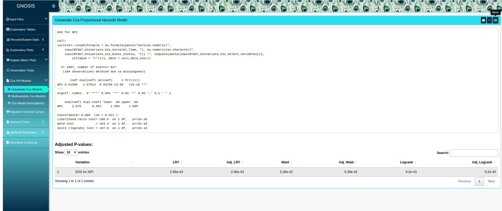
```
<br>
```{r,echo=FALSE}
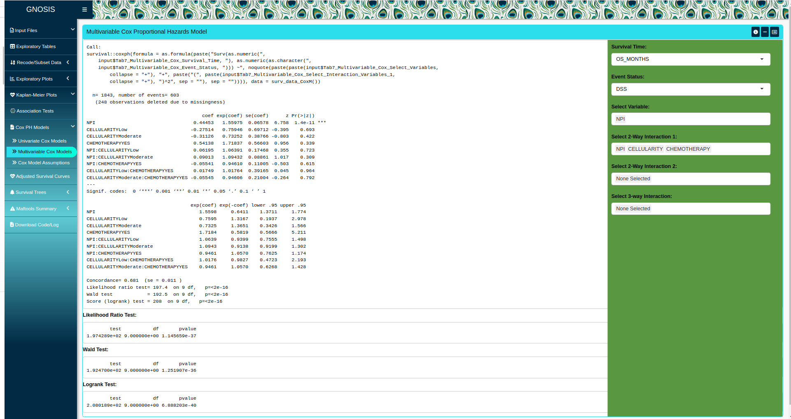
```
<br>
```{r,echo=FALSE}
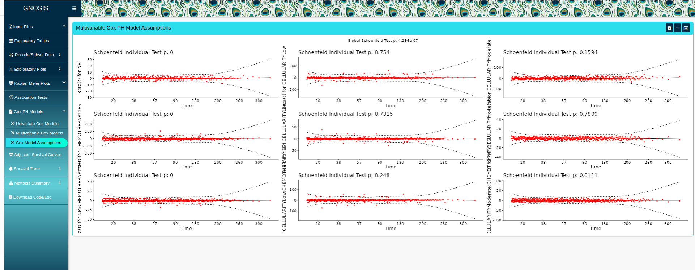
```

<br>

The corresponding adjusted survival curves, survival curves adjusted for the 
covariates in the multivariable Cox model, can also be produced and customised:

```{r,echo=FALSE}
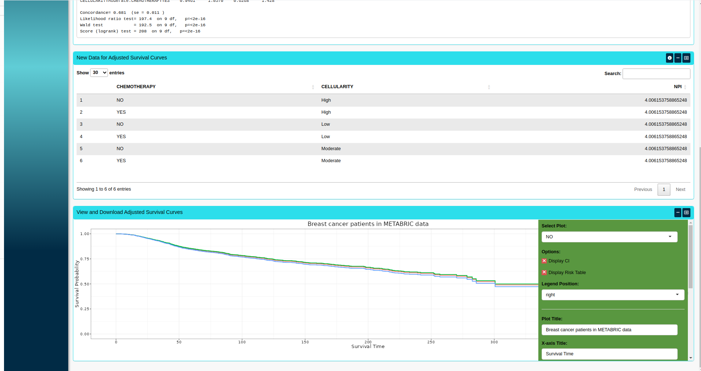
```

<br>

In the case where the PH assumption of the multivariable Cox model is violated, 
users can apply recursive partitioning survival trees: 

```{r,echo=FALSE}
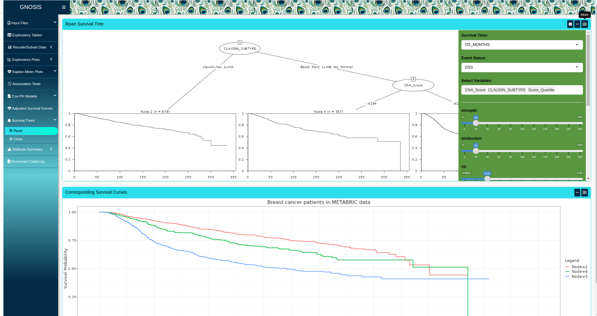
```

# Mutation Analysis

An additional function of GNOSIS is the ability to summarise, analyse and 
visualise mutation annotation format (MAF) files using maftools. 

```{r,echo=FALSE}
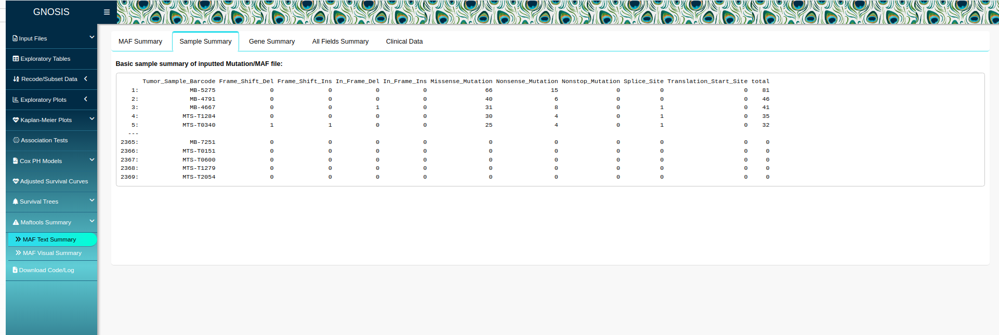
```
<br>
```{r,echo=FALSE}
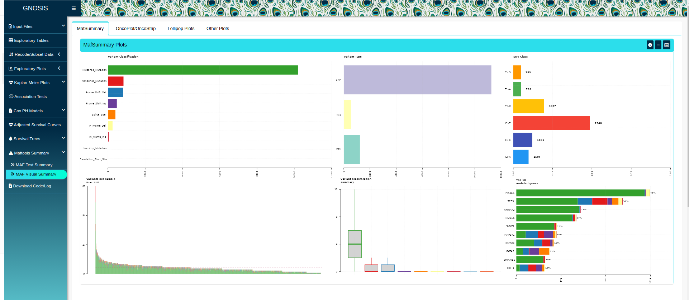
```
<br>
```{r,echo=FALSE}
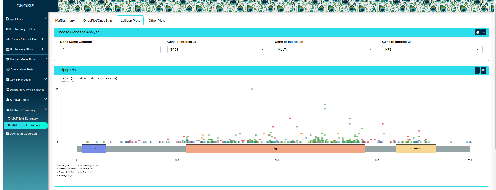
```

# Input Log

GNOSIS facilitates reproducible research by allowing users to download an input 
log containing information on all the inputs selected throughout the session:

```{r,echo=FALSE}
knitr::include_graphics("figures/GNOSIS_Input_Log.png")
```

# Additional Resources

For details on the implementation, layout and application of GNOSIS see the 
corresponding [publication](https://hrbopenresearch.org/articles/5-8#). 
Demonstration videos providing a walkthrough of GNOSIS are also provided on 
[Zenodo](https://zenodo.org/record/5788659). 

# Session Info

```{r}
sessionInfo()
```
