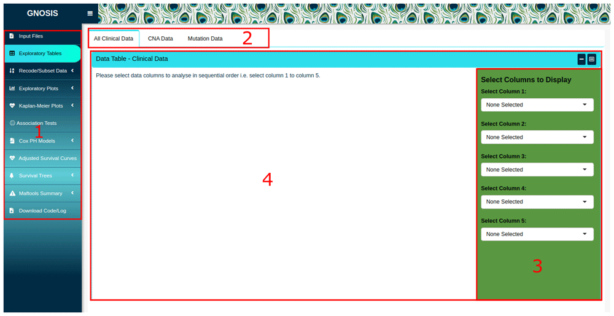

# GNOSIS

`GNOSIS` is a `shiny` app that enables the exploration, visualisation and 
analysis of clinical and CNA summary data uploaded manually or obtained 
from cBioPortal, through `cBioPortalData`. GNOSIS provides an intuitive 
GUI with multiple tab panels supporting a range of functionalities including 
data upload and initial exploration, data recoding and subsetting, multiple 
visualisations, survival analysis, statistical analysis and mutation analysis.

# Installation

```{r, eval=FALSE}
if (!requireNamespace("BiocManager", quietly = TRUE)) {
    install.packages("BiocManager")
}

BiocManager::install("GNOSIS")
```

# Loading the package

```{r,include=TRUE, results="hide", message=FALSE, warning=FALSE}
library(GNOSIS)
```

# Launching GNOSIS

```{r, eval=FALSE}
GNOSIS()
```

# GNOSIS Layout 

The GNOSIS GUI has 4 main elements:
(1) A sidebar where each analysis tab can be selected, the Exploratory Tables tab is selected and displayed. 
(2) Tab panels within each tab, allowing multiple operations to be carried out and viewed in the one tab. 
(3) A box sidebar allowing users to select inputs, alter arguments and customise and export visualisations. 
(4) Main viewing panel displaying output.

```{r,echo=FALSE}

```

# Operation

For details on the implementation, layout and application of GNOSIS see the corresponding [publication](https://hrbopenresearch.org/articles/5-8#). 
Demonstration videos providing a walkthrough of GNOSIS are also provided on [Zenodo](https://zenodo.org/record/5788659). 

# Session Info

```{r}
sessionInfo()
```
